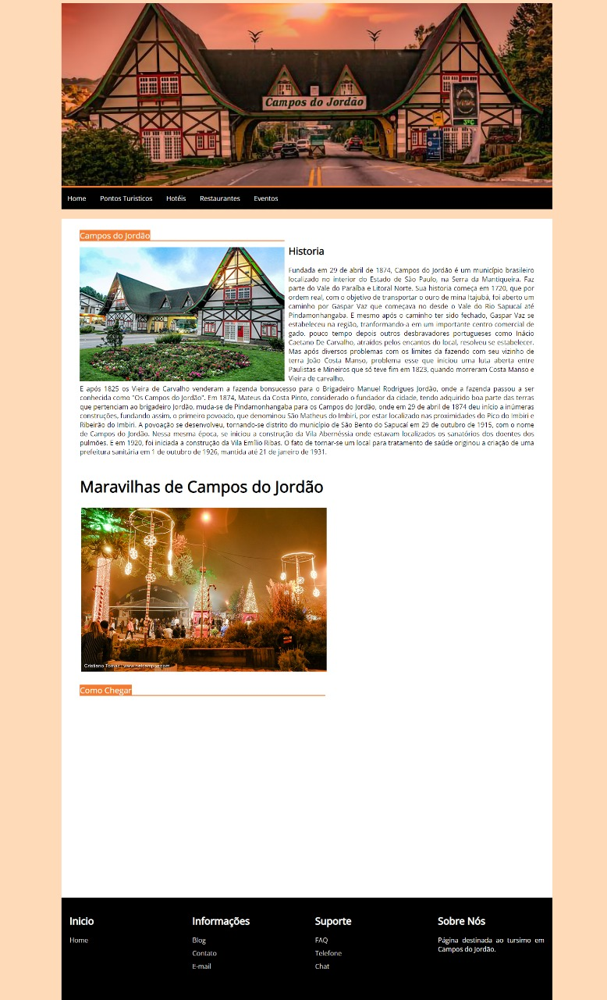

# Turismo em Campos do Jordão

> Status do projeto: Finalizado (Serve como laboratório de teste)

<h3>Primeiro projeto desenvolvido no curso de Ciências da Computação - UNIP</h3> 

A proposta desse site era mostrar os pontos turísticos da cidades de Campos do Jordão. Ele foi desenvolvido como projeto de final de semestre. 

Foram usados ferramentas como HTML, CSS e JavaScript. 

O site possui um layout simples, mas agradável. É de fácil navegação para o usuário, e também possui responsividade permitindo que o site se adapte a diferentes tamanhos. 

  <h3>Imagem da Home do site</h3>
  
<strong>
  <h4>Imagem do Google Maps não disponível no print</h4>
</strong>

